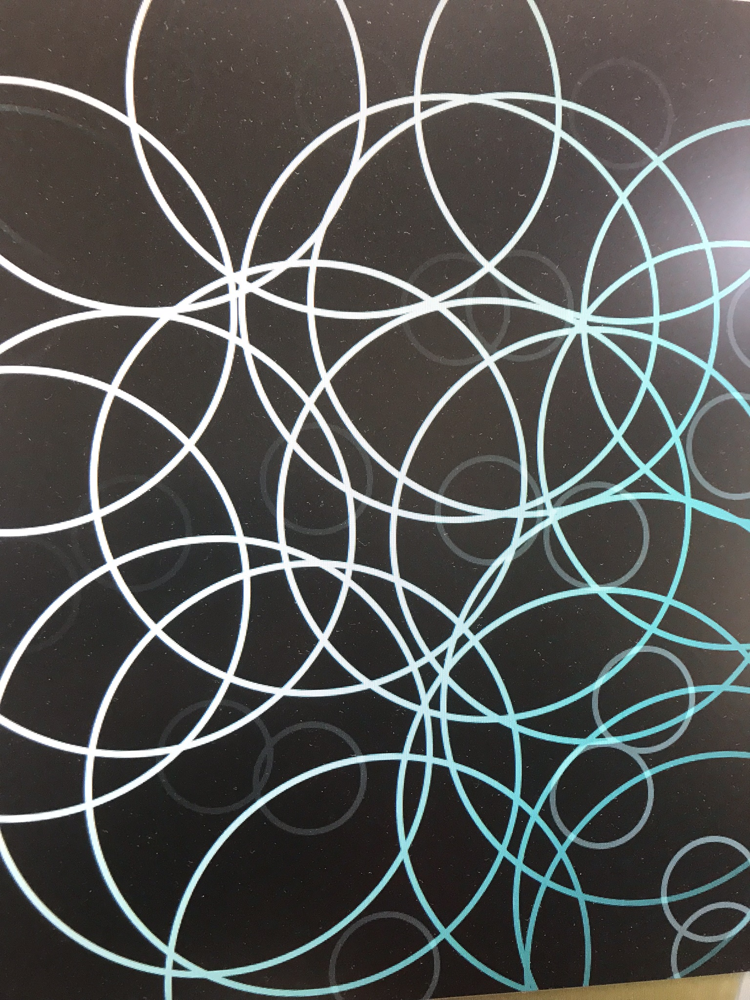
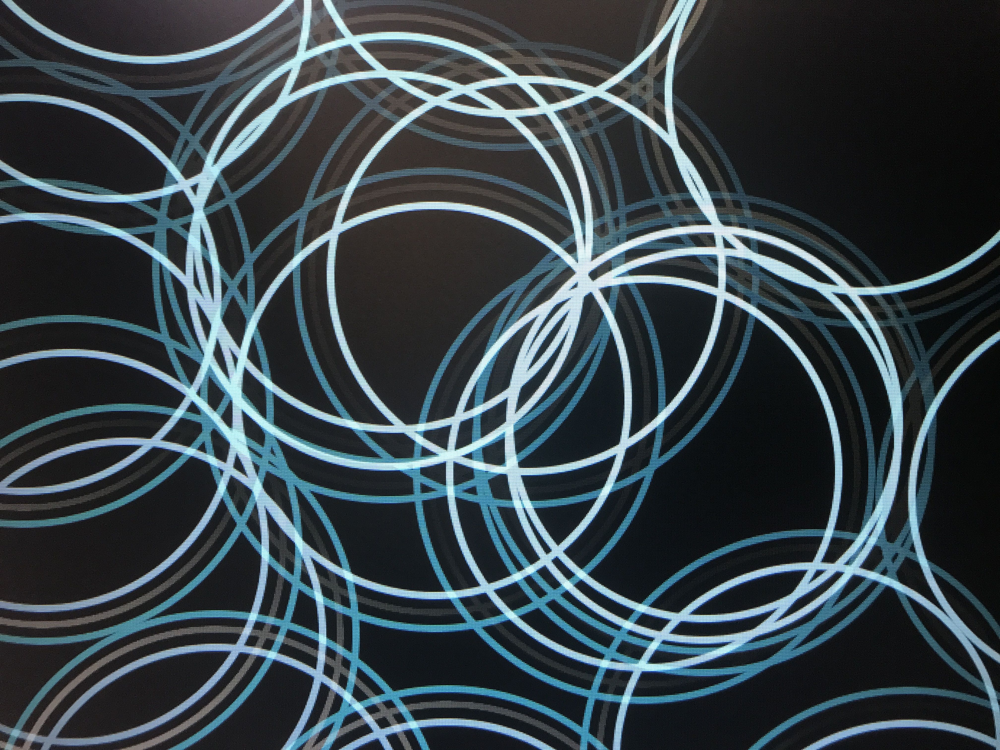

# SoundCircle

## OverView
Processingを用いた円形ビジュアライザ

## Description
Processingを使ってパソコンのマイクから拾った音声を可視化できます。
音楽鑑賞から、プロジェクターを使って弾いてみた、歌ってみたの背景素材としても使うことができると思います。

## Demo

スクリーンショットだと、残像が残らないため直撮りしています。
